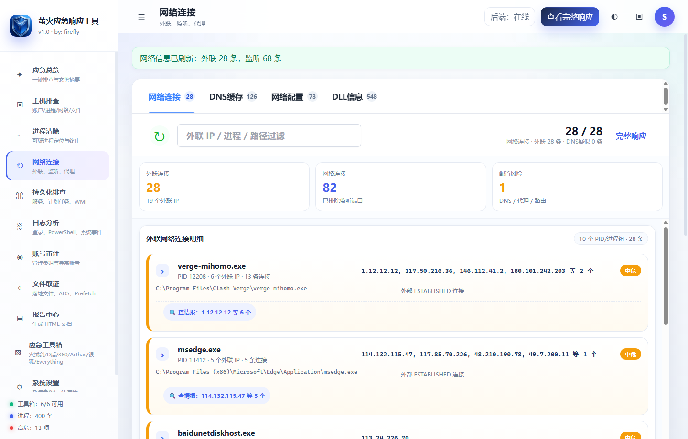
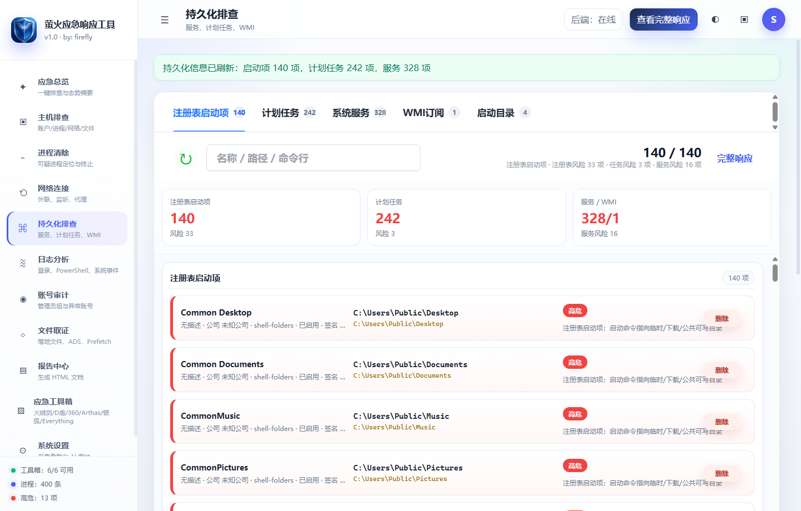
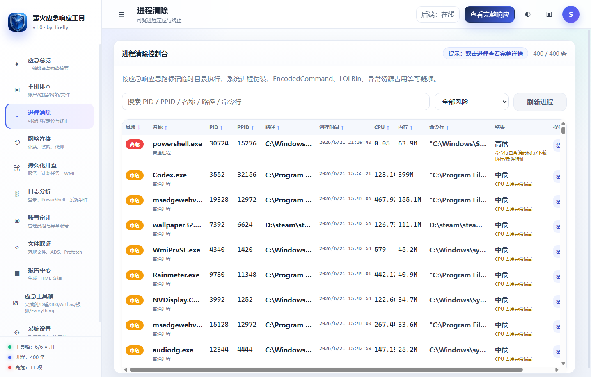
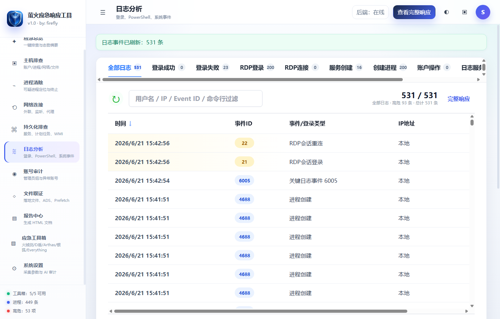
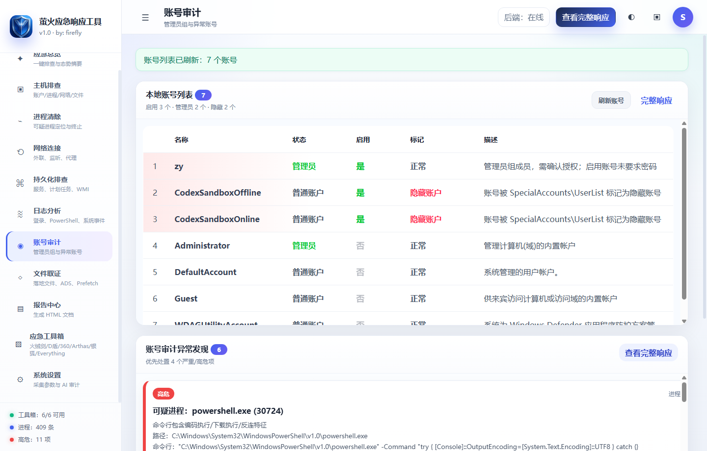
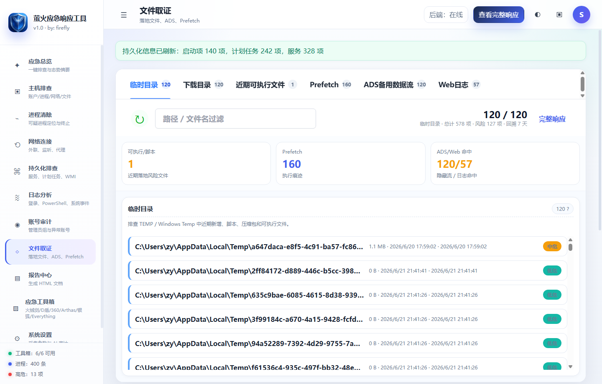
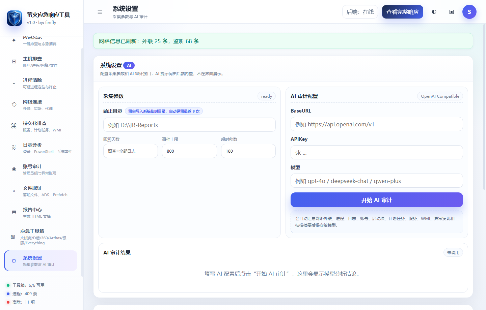

# 萤火应急响应工具

`萤火应急响应工具` 是一个面向 Windows 主机应急响应场景的轻量化图形客户端，作者标识为 `by: firefly`，当前版本 `1.0`。工具核心目标是把现场常用的账号、进程、网络、持久化、日志、文件取证、报告输出和辅助工具箱整合到一个可双击运行的客户端里，帮助应急人员快速完成“采集证据、提取异常、辅助处置、输出报告”的闭环。

项目同时保留 Linux 采集脚本，用于 Linux 主机的基础应急响应数据采集和 HTML 报告输出。

## 界面预览

### 应急总览


### 网络连接



### 持久化排查



### 进程清除



### 日志分析



### 账号审计



### 文件取证



### 应急工具箱


### 系统设置与 AI 审计



## 核心能力

- 单文件 Windows 客户端：`release\萤火应急响应工具.exe` 可直接双击运行，前端资源已嵌入 Go 后端。
- 本地化采集：所有采集接口默认运行在本机 `127.0.0.1`，用于客户端 UI 调用。
- 图形化模块：左侧为应急响应模块导航，右侧展示结构化摘要、异常发现、完整响应和处置入口。
- 并发采集：智能排查任务按模块并行执行，完成后汇总结果并生成 HTML 报告。
- 异常提取：从进程、外联、DNS、路由、启动项、计划任务、服务、WMI、日志、账号、文件落地等数据中提取可疑点。
- 完整响应：每个模块都保留原始响应入口，便于复核命令输出和证据链。
- 右键定位：网络连接、持久化、文件取证等包含路径的行支持右键选择“打开所在目录”。
- 处置辅助：支持进程结束、计划任务删除、服务删除、注册表启动项删除、WMI 订阅删除、启动目录文件备份后删除。
- AI 审计：可配置 BaseURL、API Key、模型，让外部大模型基于当前采集证据生成审计结论和 HTML 报告。
- 应急工具箱：集成火绒剑、D盾、Arthas 内存马查杀、银狐查杀、Everything 文件搜索等工具入口。

## Windows 客户端模块

### 1. 应急总览

总览页用于发起一键智能排查、设置输出目录、回溯天数、事件上限和超时时间。页面会汇总高危发现、可疑进程、中低风险、排查阶段和专家补充建议。

重点用途：

- 快速启动全量排查。
- 查看当前发现数量和风险趋势。
- 进入完整响应和 HTML 报告。
- 在未发现明确异常时给出下一步复核方向。

### 2. 主机排查

主机排查关注系统基础信息和运行环境，包括：

- 当前用户、权限、用户组和特权。
- Windows 产品名称、版本、构建号、架构、域信息、时区。
- IP 配置、系统信息、补丁和基础环境。
- 作为后续账号、进程、网络、日志关联分析的基线。

### 3. 进程清除

进程模块展示进程列表、PID、PPID、进程名、路径、命令行、启动时间、CPU、内存、签名状态、厂商、风险等级和原因。

支持能力：

- 按关键字搜索进程。
- 按风险等级过滤。
- 点击列头排序。
- 双击进程查看详细信息。
- 普通结束或强制结束进程树。
- 对临时目录执行、AppData 执行、EncodedCommand、脚本宿主、LOLBin、系统进程伪装等行为做风险提示。

使用建议：

- 清除进程前先记录 PID、PPID、路径、命令行、父子关系、外联 IP 和相关持久化项。
- 如果进程存在服务、计划任务、WMI、注册表启动项等复活机制，应先定位持久化来源再清除。

### 4. 网络连接

网络模块会读取 TCP 连接、监听端口、DNS 缓存、DNS 服务器、路由表、代理配置和进程 DLL 信息。

重点展示：

- 外联连接数量和外联 IP 数量。
- 同一 PID 的多个外联 IP 会聚合展示，可展开查看全部外联 IP。
- 每条外联关联 PID、进程名、进程路径、命令行和风险原因。
- DNS、代理、路由配置单独标记，避免把常见公共 DNS 简单误判为异常。
- 对外部 ESTABLISHED 连接、异常监听端口、代理篡改、持久路由等做提示。

常见研判思路：

- 外联 IP 是否属于业务系统、云厂商、CDN、公共 DNS 或常见软件服务。
- 外联进程路径是否位于系统目录、程序安装目录、临时目录、用户目录或下载目录。
- 外联进程是否具备签名，签名厂商是否可信。
- 是否存在同一进程短时间连接多个陌生 IP、异常端口或可疑域名。

### 5. 持久化排查

持久化模块覆盖注册表启动项、计划任务、系统服务、WMI 永久订阅和启动目录文件。

采集范围：

- `HKLM/HKCU Run`、`RunOnce`、`WOW6432Node Run`、`Winlogon`。
- 计划任务及其执行程序、参数、作者、状态、上次运行和下次运行时间。
- 系统服务和驱动，包括名称、显示名、状态、启动类型、运行账户、路径、签名和厂商。
- WMI `__EventFilter`、`__EventConsumer`、`__FilterToConsumerBinding`。
- 用户和系统启动目录文件。

处置能力：

- 删除计划任务。
- 删除系统服务。
- 删除注册表启动项。
- 删除 WMI 永久订阅。
- 启动目录文件先备份到 `%TEMP%\ir-deleted-backup` 后删除。

风险关注点：

- 指向临时目录、下载目录、用户目录、隐藏路径的启动项。
- 使用 `powershell/cmd/mshta/rundll32/regsvr32/certutil/bitsadmin/wscript/cscript` 的计划任务。
- 服务路径未加引号、非标准目录服务、无签名服务、异常启动账户。
- WMI 过滤器和消费者组合形成的无文件持久化。

### 6. 日志分析

日志模块对 Windows 关键事件进行结构化聚合。日志数量较多时刷新可能需要十几秒到数分钟，界面出现“日志事件已刷新”并显示总数后再截图或生成报告。

覆盖事件：

- 登录成功：`4624`、`4648`、`4672`、`4778`。
- 登录失败：`4625`、`4771`、`4776`、`4779`。
- RDP 登录/连接：终端服务相关事件。
- 服务创建：`7045`。
- 进程创建：`4688`。
- 账号操作：`4720`、`4722`、`4723`、`4724`、`4725`、`4726`、`4728`、`4729`、`4732`、`4733`、`4738`、`4740`。
- 日志服务关闭：`1100`、`6006`。
- 审计日志清除：`1102`。
- PowerShell：`4103`、`4104` 等。

界面会提取时间、事件 ID、登录类型、源 IP、端口、用户名、日志源、摘要和风险级别。完整响应中可筛选 GET、POST 和自定义关键字，便于查看 Web 日志和原始输出。

### 7. 账号审计

账号审计模块列出本地用户、管理员组成员、登录时间、密码设置时间、SID、启用状态、管理员状态和隐藏用户标记。

重点关注：

- 用户名以 `$` 结尾的隐藏账户。
- 非预期管理员组成员。
- 最近新增、启用、禁用、删除或修改密码的账号。
- SID 异常、克隆账号、长期未登录但突然活跃的账号。
- 远程登录来源 IP 和登录类型。

### 8. 文件取证

文件取证模块用于快速定位落地样本、脚本、WebShell、ADS 和执行痕迹。

分类包括：

- 临时目录文件。
- 下载目录文件。
- 近期可执行文件和脚本。
- Prefetch 执行痕迹。
- NTFS ADS 备用数据流。
- Web 日志关键命中。

常见排查方向：

- `.exe/.dll/.ps1/.vbs/.js/.bat/.cmd/.jsp/.php/.aspx` 等文件。
- 最近修改时间集中在入侵窗口附近的文件。
- 文件名伪装系统进程、双扩展名、隐藏属性或异常路径。
- Prefetch 中已执行但源文件被删除的程序。

### 9. 报告中心

报告中心用于输出静态 HTML 应急响应报告。

报告内容包括：

- 系统概览。
- 风险发现。
- 模块摘要。
- 原始命令输出。
- 可疑证据片段。
- 清除建议。
- AI 审计结果。
- GET/POST/自定义筛选能力。

报告适合归档、复盘和交付。生成报告前建议先完成一次智能排查，并根据实际业务白名单复核关键风险项。

### 10. 应急工具箱

工具箱用于集成现场常用工具，点击卡片即可启动或打开目录。

当前集成：

| 工具                | 场景                                              | 默认入口                                 |
| ------------------- | ------------------------------------------------- | ---------------------------------------- |
| 火绒剑              | 进程、驱动、句柄、启动项、网络连接深度排查        | `应急工具\火绒5.0独立版\SecAnalysis.exe` |
| D盾                 | WebShell、隐藏账号、克隆账号、IIS 安全检查        | `d盾\D_Safe_Manage.exe`                  |
| Arthas 内存马查杀   | Java 进程、ClassLoader、Filter/Servlet 内存马排查 | `arthas-内存马查杀工具`                  |
| 银狐查杀            | 银狐木马、远控木马、异常落地文件专项查杀          | `银狐查杀\银狐查杀.exe`                  |
| Everything 文件搜索 | 快速搜索可疑样本、WebShell、脚本和落地文件        | `Everything\everything.exe`              |

工具箱会优先从统一目录 `应急工具` 查找这些工具，同时兼容旧版平铺工具目录。核心客户端是单文件 exe，工具箱中的第三方工具属于可选外部工具，只有放在约定目录下才会显示可用。

### 11. 系统设置与 AI 审计

系统设置中可以配置：

- 输出目录。
- 回溯天数，默认留空表示查询全部可查询日志。
- 事件上限。
- 单任务超时。
- AI BaseURL。
- AI API Key。
- AI 模型。

AI 审计使用内置提示词，不在 UI 中展示。AI 会基于已采集的网络连接、进程、日志、账号、启动项、服务、计划任务、WMI、文件取证等证据进行综合研判，并输出 AI 审计 HTML 报告。

建议 AI 审计关注：

- 是否存在后门账号、隐藏账号、克隆账号。
- 是否存在 C2 外联、异常端口、异常代理、异常路由。
- 是否存在无签名或伪装系统进程。
- 是否存在计划任务、服务、WMI、注册表启动项等持久化。
- 是否存在日志清除、PowerShell 下载执行、EncodedCommand、横向移动和 WebShell 痕迹。
- 区分确认风险、高度可疑、需白名单确认、可能误报和证据不足。

## Windows 运行方式

推荐直接运行：

```powershell
C:\Users\zy\Desktop\应急响应工具\release\萤火应急响应工具.exe
```

常用参数：

```powershell
# 指定监听地址
.\release\萤火应急响应工具.exe -addr 127.0.0.1:8765

# 仅启动后端，不打开窗口，适合自动化验证
.\release\萤火应急响应工具.exe -no-window -addr 127.0.0.1:18785

# 强制使用 WebView 窗口
.\release\萤火应急响应工具.exe -webview

# 使用浏览器兼容模式
.\release\萤火应急响应工具.exe -browser
```

说明：

- 普通 Windows 桌面环境默认打开图形化客户端窗口。
- Windows Server 或缺少 WebView2 Runtime 的环境可能使用浏览器兼容模式。
- 后端 API 只监听本机地址，不对外暴露。

## Windows 构建方式

一键构建单文件 exe：

```powershell
cd 'C:\Users\zy\Desktop\应急响应工具'
.\scripts\build_windows_single_exe.ps1
```

构建脚本会执行：

1. 构建 React 前端。
2. 将 `web/dist` 复制到 Go embed 目录。
3. 运行 `go test ./cmd/irgui`。
4. 使用 `go build -trimpath -ldflags "-H windowsgui -s -w"` 生成 Windows GUI exe。
5. 输出到 `release\萤火应急响应工具.exe`。

手动验证：

```powershell
cd 'C:\Users\zy\Desktop\应急响应工具\windows-ir-gui'
go test ./cmd/irgui

cd 'C:\Users\zy\Desktop\应急响应工具\windows-ir-gui\web'
npm run build
```

## Linux 采集脚本

Linux 侧脚本位于：

```text
linux-ir\ir_linux_collect.sh
```

示例：

```bash
bash ir_linux_collect.sh --out ./ir-run --days 7 --web-root "/var/www /srv/www /usr/share/nginx/html" --max-log-lines 5000
```

输出内容：

- `raw/*.txt`：各模块原始输出。
- `findings.tsv`：结构化发现。
- `report.html`：HTML 应急响应报告。

Linux 排查覆盖：

- UID 0 特权用户。
- 可远程登录用户。
- sudo 权限。
- SSH authorized_keys。
- 登录成功/失败日志。
- 进程、网络连接、监听端口。
- crontab、systemd、rc.local、profile/bashrc。
- 临时目录、SUID/SGID、WebShell 关键字。
- Rootkit 检测辅助信息。

## 项目结构

```text
应急响应工具
├─ release
│  └─ 萤火应急响应工具.exe          # 单文件 Windows 客户端
├─ windows-ir-gui
│  ├─ cmd\irgui                    # Go 后端、采集、分析、报告、工具箱
│  └─ web                           # React/Vite 前端
├─ linux-ir
│  └─ ir_linux_collect.sh           # Linux 应急采集脚本
├─ scripts
│  └─ build_windows_single_exe.ps1  # 单文件 exe 构建脚本
├─ docs\images                      # README 截图资源
└─ 应急工具                         # 可选工具箱统一目录
   ├─ 火绒5.0独立版                  # SecAnalysis.exe
   ├─ d盾                            # D_Safe_Manage.exe
   ├─ arthas-内存马查杀工具           # Java 内存马排查
   ├─ 银狐查杀                        # 银狐查杀.exe
   └─ Everything                     # everything.exe
```

## 本地 API

Windows 客户端内部使用以下本地 API：

| API                                   | 用途                                        |
| ------------------------------------- | ------------------------------------------- |
| `GET /api/status`                     | 客户端状态、版本、主机名和 Skill 信息       |
| `GET /api/processes`                  | 进程列表、风险原因、签名、路径和命令行      |
| `POST /api/processes/{pid}/terminate` | 结束进程树                                  |
| `GET /api/host`                       | 主机基础信息                                |
| `GET /api/accounts`                   | 本地账号、管理员组、隐藏账号标记            |
| `GET /api/events`                     | 关键 Windows 事件日志                       |
| `GET /api/network`                    | 网络连接、DNS、路由、代理、DLL 信息         |
| `GET /api/persistence`                | 注册表启动项、计划任务、服务、WMI、启动目录 |
| `GET /api/files`                      | 文件取证结果                                |
| `GET /api/tools`                      | 工具箱状态                                  |
| `POST /api/tools/{id}/launch`         | 启动工具箱工具                              |
| `POST /api/scans`                     | 发起完整排查                                |
| `GET /api/scans/{id}`                 | 查询排查状态和结果                          |
| `GET /api/scans/{id}/report`          | 打开或生成 HTML 报告                        |
| `POST /api/ai-audit`                  | 发起 AI 审计                                |

## 风险判断逻辑

工具会综合以下特征给出风险提示：

- 路径异常：临时目录、用户下载目录、AppData、隐藏路径、非标准系统进程路径。
- 命令异常：`EncodedCommand`、下载执行、脚本宿主、LOLBin、命令混淆。
- 网络异常：外部 ESTABLISHED 连接、异常端口、代理配置、持久路由、可疑 DNS。
- 持久化异常：计划任务、服务、WMI、Run/RunOnce、启动目录文件。
- 账号异常：隐藏账号、管理员组异常成员、异常登录时间、账号创建/启用/删除。
- 日志异常：日志清除、服务创建、PowerShell 脚本块、RDP 登录、登录失败爆破。
- 文件异常：近期落地可执行文件、脚本、ADS、Prefetch 执行痕迹、WebShell 关键字。
- 签名异常：无签名、签名不可信、系统进程伪装、厂商不匹配。

风险等级仅作为现场快速筛选依据，最终结论应结合业务白名单、威胁情报、EDR/HIDS、网络设备日志和人工复核。

## 推荐应急流程

1. 确认主机范围、时间窗口和当前权限。
2. 先运行“智能排查”，不要急于删除文件或重启系统。
3. 查看“异常发现与清除建议”，优先处理高危项。
4. 对外联进程关联 PID、路径、命令行、签名、父进程和启动方式。
5. 对可疑账号关联登录事件、源 IP、管理员组变更和密码修改时间。
6. 对可疑持久化项先导出证据，再执行删除或隔离。
7. 对可疑文件记录路径、哈希、时间戳、Prefetch 和 Web 日志命中。
8. 生成 HTML 报告归档。
9. 必要时配置 AI 审计做二次复核。
10. 完成清除后再次执行排查，确认无复活项和残留外联。

## 处置注意事项

- 不建议在采集前重启主机，重启可能丢失内存态进程、网络连接和临时证据。
- 清除进程前先记录证据，避免直接结束导致溯源断链。
- 删除服务、计划任务、WMI、启动项前确认是否为业务组件。
- 隔离或删除文件前记录路径、哈希、签名、创建时间、修改时间和来源。
- AI 审计结果只作为辅助研判，不替代人工确认。
- 第三方杀毒或专项工具的查杀动作可能隔离文件，执行前建议先生成本工具报告。

## 版本信息

- 产品名称：萤火应急响应工具
- 当前版本：`1.0`
- 作者标识：`by: firefly`
- Windows 客户端：Go + React + Vite + WebView2/浏览器兼容模式
- Linux 采集：Shell 脚本


